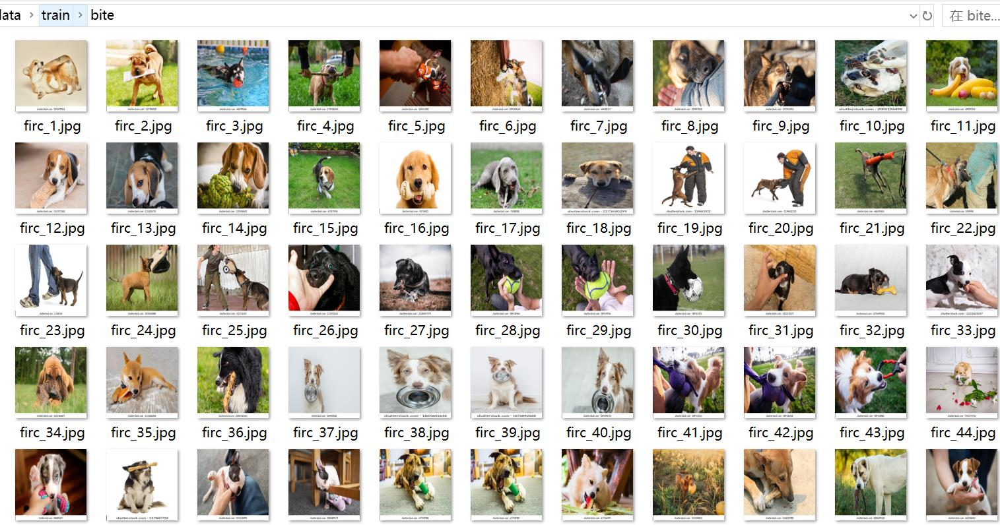
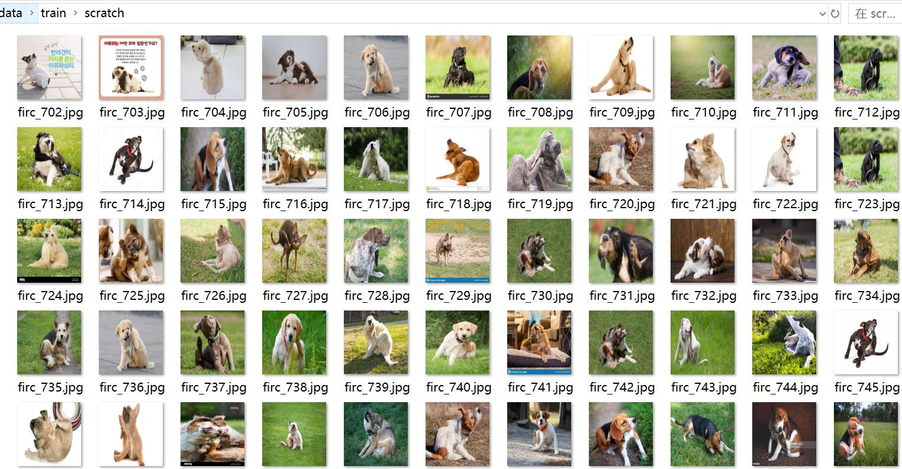
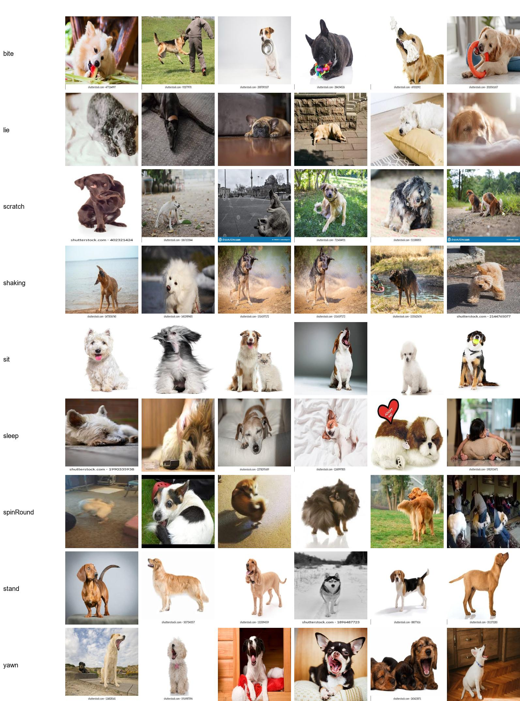

# Dog Behavior Action Classification Dataset: 5015 Images in 9 Categories

Dataset Type: Image classification for use, not suitable for target detection without labeled files.
Dataset Format: Only contains JPG images, each category folder holds the corresponding image.
Number of Images (JPG Files): 5015
Number of Categories: 9
Category Names: ['bite', 'lie', 'scratch', 'shaking', 'sit', 'sleep', 'spinRound', 'stand', 'yawn']
Image Resolution: 720x720
Number of Images per Category:
Training Set Images: 4513
- bite (Bite) Training Set Images: 381
- lie (Lie) Training Set Images: 320
- scratch (Scratch) Training Set Images: 889
- shaking (Shaking) Training Set Images: 431
- sit (Sit) Training Set Images: 299
- sleep (Sleep) Training Set Images: 903
- spinRound (Spin Round) Training Set Images: 119
- stand (Stand) Training Set Images: 291
- yawn (Yawn) Training Set Images: 880
Validation Set Images: 502
- bite (Bite) Validation Set Images: 51
- lie (Lie) Validation Set Images: 21
- scratch (Scratch) Validation Set Images: 110
- shaking (Shaking) Validation Set Images: 43
- sit (Sit) Validation Set Images: 33
- sleep (Sleep) Validation Set Images: 102
- spinRound (Spin Round) Validation Set Images: 12
- stand (Stand) Validation Set Images: 25
- yawn (Yawn) Validation Set Images: 105
Test Set Images: 0
Total Images:
- bite (Bite) Total Images: 432
- lie (Lie) Total Images: 341
- scratch (Scratch) Total Images: 999
- shaking (Shaking) Total Images: 474
- sit (Sit) Total Images: 332
- sleep (Sleep) Total Images: 1005
- spinRound (Spin Round) Total Images: 131
- stand (Stand) Total Images: 316
- yawn (Yawn) Total Images: 985
Important Notes: No specific notes provided.
Special Declaration: This dataset does not guarantee the accuracy of the trained models or weights files.
Image Preview:

## Images

Here is a pay link on Stripe ( https://buy.stripe.com/3cs8yP7sY87d0vu9AB ). Please contact me lonlonago@foxmail.com after funding $89, and I will send you a complete data files , thank you!

